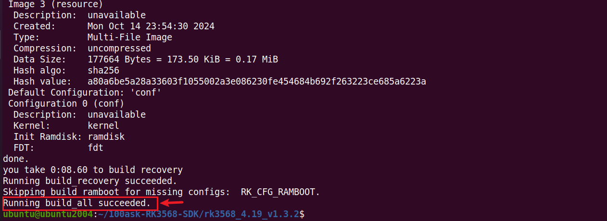
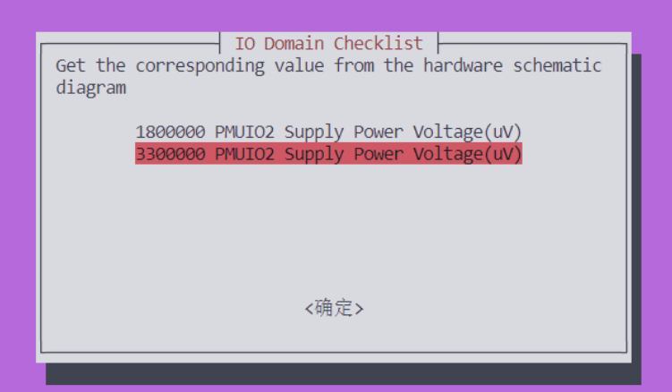
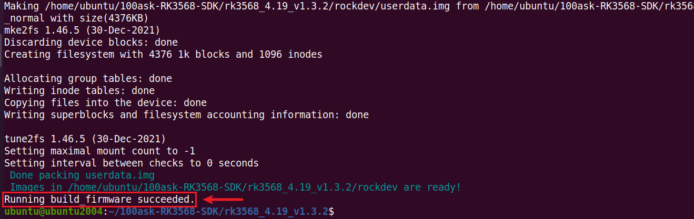
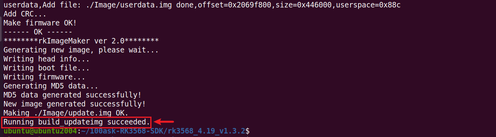

# 编译固件

## 1.选择板级配置文件

进入 SDK 包根目录，执行以下指令：

~~~bash
./build.sh lunch
~~~

选择 `BoardConfig-rk3568-100ask-ddr4.mk`

~~~bash
ubuntu@ubuntu2004:~/100ask-RK3568-SDK/rk3568_4.19_v1.3.2$ ./build.sh lunch
processing option: lunch

You're building on Linux
Lunch menu...pick a combo:

0. default BoardConfig.mk
1. BoardConfig-ab-base.mk
2. BoardConfig-rk3566-evb2-lp4x-v10-32bit.mk
3. BoardConfig-rk3566-evb2-lp4x-v10.mk
4. BoardConfig-rk3568-100ask-ddr4.mk
5. BoardConfig-rk3568-evb1-ddr4-v10-32bit.mk
6. BoardConfig-rk3568-evb1-ddr4-v10-spi-nor-64M.mk
7. BoardConfig-rk3568-evb1-ddr4-v10.mk
8. BoardConfig-rk3568-nvr-spi-nand.mk
9. BoardConfig-rk3568-nvr.mk
10. BoardConfig-rk3568-uvc-evb1-ddr4-v10.mk
11. BoardConfig-security-base.mk
12. BoardConfig.mk
Which would you like? [0]: 4
switching to board: /home/ubuntu/100ask-RK3568-SDK/rk3568_4.19_v1.3.2/device/rockchip/rk356x/BoardConfig-rk3568-100ask-ddr4.mk
~~~

## 2.编译

在当前目录下，执行编译所有：

~~~bash
./build.sh all
~~~

这个过程耗时较长，具体多久，根据电脑性能决定。

在编译过程，可能你会遇到一下界面，

这里需要选择相应的电压，根据以下电压设置进行选择，

~~~bash
&pmu_io_domains {
        status = "okay";
        pmuio2-supply = <&vcc3v3_pmu>;
        vccio1-supply = <&vccio_acodec>; /*3v3*/
        vccio3-supply = <&vccio_sd>;     /*3v3*/
        vccio4-supply = <&vcc_1v8>;
        vccio5-supply = <&vcc_3v3>;
        vccio6-supply = <&vcc_1v8>;
        vccio7-supply = <&vcc_3v3>;
};
~~~

如果电压值选择不正确，会提示编译错误。

## 3.打包固件

编译时长较久，等待编译完成后，执行以下指令，把所有镜像打包到 SDK 包 rockdev/ 下，

~~~bash
./build.sh firmware
~~~

如下：

接着，把所有镜像打包成一个 update.img 固件，用于烧录到板子上，

~~~bash
./build.sh updateimg
~~~

> 注意：上面三步，其实相当于直接执行./build.sh

编译打包完成后，固件保存在 SDK 包 rockdev/ 下，用于烧录的镜像是`update.img`。

~~~bash
ubuntu@ubuntu2004:~/100ask-RK3568-SDK/rk3568_4.19_v1.3.2$ ls -lh ./rockdev/
total 536M
lrwxrwxrwx 1 ubuntu ubuntu   18 Oct 14 23:56 boot.img -> ../kernel/boot.img
lrwxrwxrwx 1 ubuntu ubuntu   41 Oct 14 23:56 MiniLoaderAll.bin -> ../u-boot/rk356x_spl_loader_v1.16.112.bin
lrwxrwxrwx 1 ubuntu ubuntu   44 Oct 14 23:56 misc.img -> ../device/rockchip/rockimg/wipe_all-misc.img
-rw-rw-r-- 1 ubuntu ubuntu  17M Oct 14 23:56 oem.img
lrwxrwxrwx 1 ubuntu ubuntu   53 Oct 14 23:56 parameter.txt -> ../device/rockchip/rk356x/parameter-buildroot-fit.txt
lrwxrwxrwx 1 ubuntu ubuntu   64 Oct 14 23:56 recovery.img -> ../buildroot/output/rockchip_rk356x_recovery/images/recovery.img
lrwxrwxrwx 1 ubuntu ubuntu   61 Oct 14 23:54 rootfs.ext4 -> ../buildroot/output/rockchip_rk3568_100ask/images/rootfs.ext2
lrwxrwxrwx 1 ubuntu ubuntu   61 Oct 14 23:56 rootfs.img -> ../buildroot/output/rockchip_rk3568_100ask/images/rootfs.ext2
lrwxrwxrwx 1 ubuntu ubuntu   19 Oct 14 23:56 uboot.img -> ../u-boot/uboot.img
-rw-rw-r-- 1 ubuntu ubuntu 524M Oct 14 23:56 update.img
-rw-rw-r-- 1 ubuntu ubuntu 4.3M Oct 14 23:56 userdata.img
~~~