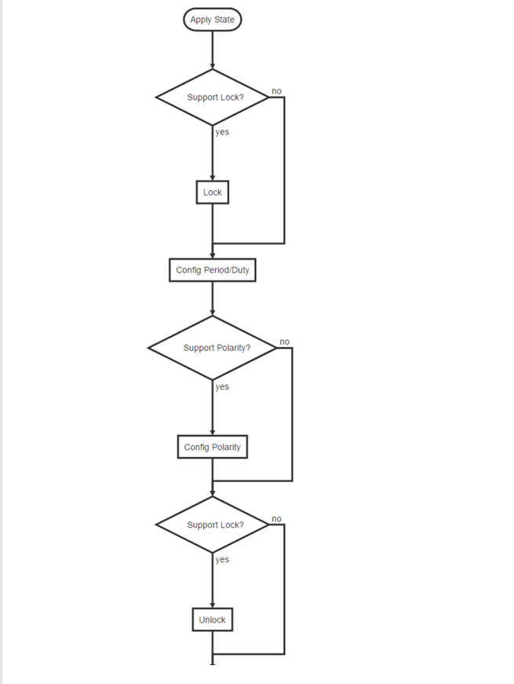
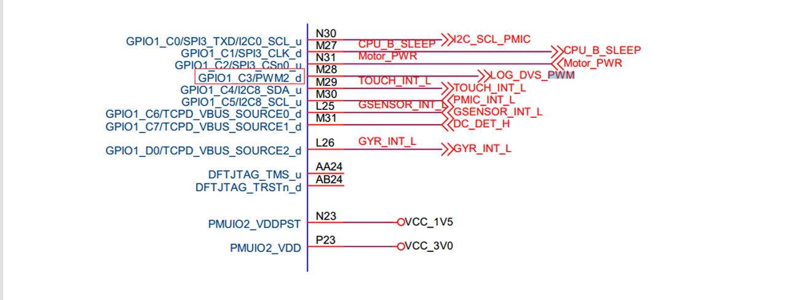

# PWM开发指南

## 1.PWM 驱动

### 1.1 驱动文件

驱动文件所在位置: drivers/pwm/pwm-rockchip.c

3.10 和 4.4 及以上版本内核下驱动文件名字是同一个，pwm-rockchip.c 只支持 Continuous mode, 但是里面的代码有些差别｡4.4 及以上内核版本将 pwm_config (),pwm_enable () 和 pwm_disable () 包装在 pwm_apply_state () 函数里面，这样做的好处是可以一次改变几个 PWM 参数，3.10 内核的 PWM 驱动还是原来的接口｡

### 1.2 DTS 节点配置

内核 3.10 版本和 4.4 版本的 DTS 节点，略有不同的地方在配置的参数个数上，内核 3.10 版本配置的参数数目为 2, 内核 4.4 版本配置的参数数目为 2 或者 3; 参数数目与 PWM 节点中的 “pwm-cells” 对应，如果 “pwm-cells” 配置是 3, 则需要配置可选的极性；如果是 2, 就不需要配置极性｡内核 4.19 版本的 DTS 节点配置与 4.4 相同｡ DTS 配置参考文档 Documentation/devicetree/bindings/pwm/pwm.txt, 主要几个参数说明下:

- 参数 1, 表示 index (per-chip index of the PWM to request), 一般是 0, 因为我们 Rockchip PWM 每个 chip 只有一个｡
- 参数 2, 表示 PWM 输出波形的时间周期，单位是 ns; 例如下面配置的 25000 就是表示想要得到的 PWM 输出周期是 40K 赫兹｡
- 参数 3, 表示极性，为可选参数；下面例子中的配置为负极性｡

```plaintext
bl: backlight {
     pwms = <&pwm 0 25000 PWM_POLARITY_INVERTED>;
     pwm-names = "backlight";
};
```

## 2.PWM 流程

PWM 驱动流程在不同内核版本上大致是一样的，以内核 4.4 为例｡




以上是 Continuous mode 的软件流程，如果还想了解其他，在 TRM 中 PWM 章节部分的 Application Notes 小节，还有各模式下的寄存器配置流程，可以参考，这边就不再详细叙述｡

## 3.PWM 使用

对于 PWM 的 kernel 和 user space 使用说明在 Documentation/pwm.txt 有说明，下面重点提下 user space 部分｡就像 pwm.txt 文档里面说的，PWM 提供了用户层的接口，在 /sys/class/pwm/ 节点下面，PWM 驱动加载成功后，会在 /sys/class/pwm/ 目录下产生 pwmchip0 目录；向 export 文件写入 0, 就是打开 pwm 定时器 0, 会产生一个 pwm0 目录，相反的往 unexport 写入 0 就会关闭 pwm 定时器了，同时 pwm0 目录会被删除，该目录下有以下几个文件:

- enable: 写入 1 使能 pwm, 写入 0 关闭 pwm;
- polarity: 有 normal 或 inversed 两个参数选择，表示输出引脚电平翻转；
- duty_cycle: 在 normal 模式下，表示一个周期内高电平持续的时间 (单位：纳秒), 在 reversed 模式下，表示一个周期中低电平持续的时间 (单位：纳秒);
- period: 表示 pwm 波的周期 (单位：纳秒);

以下是 pwmchip0 的例子，设置 pwm0 输出频率 100K, 占空比 50%, 极性为正极性:

```plaintext
cd /sys/class/pwm/pwmchip0/
echo 0 > export
cd pwm0
echo 10000 > period
echo 5000 > duty_cycle
echo normal > polarity
echo 1 > enable
```

## 4.PWM Backlight

PWM 的连续模式使用最多，且背光使用较为频繁。

### 4.1 Backlight DTS

以下是 DTS 文件中背光很常见的背光配置节点:

```plaintext
backlight:backlight{
    compatible = "pwm-backlight";
    pwms = <&pwm0 0 25000 0>;
    brightness-levels=<
        0 1 2 3 4 5 6 7
        8 9 10 11 12 13 14 15
        16 17 18 19 20 21 22 23
        24 25 26 27 28 29 30 31
        32 33 34 35 36 37 38 39
        40 41 42 43 44 45 46 47
        48 49 50 51 52 53 54 55
        56 57 58 59 60 61 62 63
        64 65 66 67 68 69 70 71
        72 73 74 75 76 77 78 79
        80 81 82 83 84 85 86 87
        88 89 90 91 92 93 94 95
        96 97 98 99 100 101 102 103
        104 105 106 107 108 109 110 111
        112 113 114 115 116 117 118 119
        120 121 122 123 124 125 126 127
        128 129 130 131 132 133 134 135
        136 137 138 139 140 141 142 143
        144 145 146 147 148 149 150 151
        152 153 154 155 156 157 158 159
        160 161 162 163 164 165 166 167
        168 169 170 171 172 173 174 175
        176 177 178 179 180 181 182 183
        184 185 186 187 188 189 190 191
        192 193 194 195 196 197 198 199
        200 201 202 203 204 205 206 207
        208 209 210 211 212 213 214 215
        216 217 218 219 220 221 222 223
        224 225 226 227 228 229 230 231
        232 233 234 235 236 237 238 239
        240 241 242 243 244 245 246 247
        248 249 250 251 252 253 254 255>
    default-brightness-level = <200>;
    enable-gpios = <&gpio1 13 GPIO_ACTIVE_HIGH>;
};
```

- `pwms = <&pwm0 0 25000 0>` 上面 PWM 节点配置小节中有描述；
- brightness-lvls 数组，我们一般以值 255 为一个 scalc, 所以一般的 brightness-levels 为 256 个元素的数组。当 PWM 设置为正极性时，从 0-255 表示背光为正极，占空比从 0%~100% 变化，255-0 位负极性，占空比从 100%~0% 变化：当 PWM 设置为负极性时，反之｡
- defaul-brightness-level 表示默认的背光，它存在于开机时候，如背光驱动初始化到安卓用户层设置下来新的背光这段时间，表示为第 200 个元素的背光亮度｡
- enablcpios 表示背光使能脚，这个根据电路原理图配置即可；有的硬件没有这个背光使能脚，那么将这个配置删除，背光驱动通过配置 brighness-levels 数组的第 0 个元素将背光关闭｡

### 4.2 PWM Backlight 调试

如何确定背光灭的 brightness-level 值，通过命令行调试背光亮度，echo xxx > sys/class/backlight/backlight/brightness

当 PWM 设置为正极性时，可以通过 echo xxx > sys/class/backlight/backlight/brightness 到背光节点，xxx 的范围为 0~255, 这时观察亮度变化，如 x 为背光亮度为 0 的点，y 为客户接受的背光最亮的点｡这时重新调整 brightness-level 表，就可以将数组第一个值改为 x, 最大值改为 y, 中间值需均匀变化，凑成 256 个元素，且有一个元素值为 255｡当 PWM 为负极性时，则反之｡

## 5.常见问题

### 5.1 PWM 在 U-Boot 与 kernel 之间的衔接问题

* U-Boot 如果有用 PWM 调压功能，到了 kernel 阶段，此时 PWM 仍然是工作状态，需要根据当前 PWM 的硬件状态，将 PWM clock count 调整与当前 PWM 状态一致｡否则可能会出现 clock 架构发现无人使用的 PWM clock, 将其关闭后，导致 PWM 无法工作，出现类似 PWM 调压电压不够导致的死机问题等｡以上的补丁已经修正，确保 PWM 驱动: drivers/pwm/pwm-rockchip.c, 更新到下面的提交点:
  1. kernel-4.4: commit e6f2796ef5b660a70102c02d6c15f65ff8701d76
  2. kernel-3.10: commit 5a3d9257d5e379391eb02457ccd70f28a8fb188b

* U-Boot 与 kernel PWM 所用的时钟源的频率不同，也会导致中间出现切换，可能会导致 PWM 占空比发生变化，出现类似 PWM 调压电压不够导致的死机问题等，所以要保持 U-Boot 与 kernel 的时钟源或时钟源的频率一致｡确保 U-Boot 的 GPLL 频率与 kernel 保持一致，因为 PWM 的时钟现在都是挂在 GPLL 下面；U-Boot 的 GPLL 频率通过 U-Boot 的开机打印 log 可以看到，kernel 的频率通过查看 clock tree, cat /sys/kernel/debug/clock/clock_tree | grep gpll｡

* U-Boot 与 kernel 所配置的极性和周期不一致，也会导致中间出现切换，可能会导致 PWM 占空比发生变化，出现类似 PWM 调压电压不够导致的死机问题等，所以要保持 U-Boot 与 kernel 的极性和周期一致｡

### 5.2 PWM Regulator 时 PWM pin 脚上下拉配置问题

由于在做 reboot 的时候，很多情况是不复位 GRF 里面的寄存器，而 PWM 控制器会发生复位，这就会在 reboot 起来后改变 PWM Regulator 的默认电压，所以要在 kernel 中配置 PWM pin 脚上下拉与默认的上下拉一致，不能配置为 none｡该问题只针对 PWM 作为调压时才需要修改，作为其他功能可以不需要关注｡

* 通过硬件原理图确认该 PWM pin 的默认上下拉｡例如 RK3399 挖掘机板子 PWM2 作为调压功能，在原理图上找到 PWM2 pin 脚: GPIO1_C3/PWM2_d, 其中的 "d" 表示 down 为默认下拉；如果是 "u" 表示 up 默认上拉｡



* dtsi 中定义 PWM pull down pinctrl:

```plaintext
pwm2_pin_pull_down: pwm2-pin-pull-down {
    rockchip,pins =  <1 19 RK_FUNC_1 &pcfg_pull_down>;
 };
```

* 在 dts 中重新 PWM 覆盖 pinctrl

```
 &pwm2 {
     status = "okay";
     pinctrl-names = "active";
     pinctrl-0 = <&pwm2_pin_pull_down>;
 };
```

### 5.3 PWM 波形示波器无法测到

如果示波器测试不到波形，从两方面入手：

* 先检查 PWM Counter Register 寄存器的值是否在变化，如果有变化说明 PWM 在工作 (注意，如果 用 io 命令来读取寄存器，在产品文档的表格中 RK3328 和它之后的芯片需要再关闭 pclk 的 gating， 因为这些芯片 pclk 和工作时钟是分开的)；如果该寄存器的值没有发生变化，则说明 PWM 工作异 常。一般，这些异常分为以下几个方面：
  1. 时钟问题； 
  2. PWM 本身寄存器配置问题,PWM 未使能或者 duty 配置的值大于 period 等； 
  3. RK3368 芯片需要额外配置 GRF 中 GRF_SOC_CON15 寄存器的 bit12 为 1。

* 如果读出来的 Counter Register 寄存器的值在发生变化,则说明 PWM 工作正常，但是仍量不到信 号，应该是 pin 脚的问题，一般也分为以下几个可能： 
  	 	1. iomux 问题； 
    	2. io-domain 配置不对；
    	3. 被外面硬件干扰.