# 启动开发板

本章节将讲解如何登录开发板终端。以下有几种登录方式，建议使用串口登录，方便查看调试信息。

## 使用串口登录系统

### 准备工作

**硬件：**

- 百问网RK3568开发板 x1
- TypeC线 x1 
- TTL转串口模块 x1
- 12v电源适配器 x1

**软件：**

- 终端工具 MobaXterm

### 连接开发板

开发板DEBUG接口位置如下：

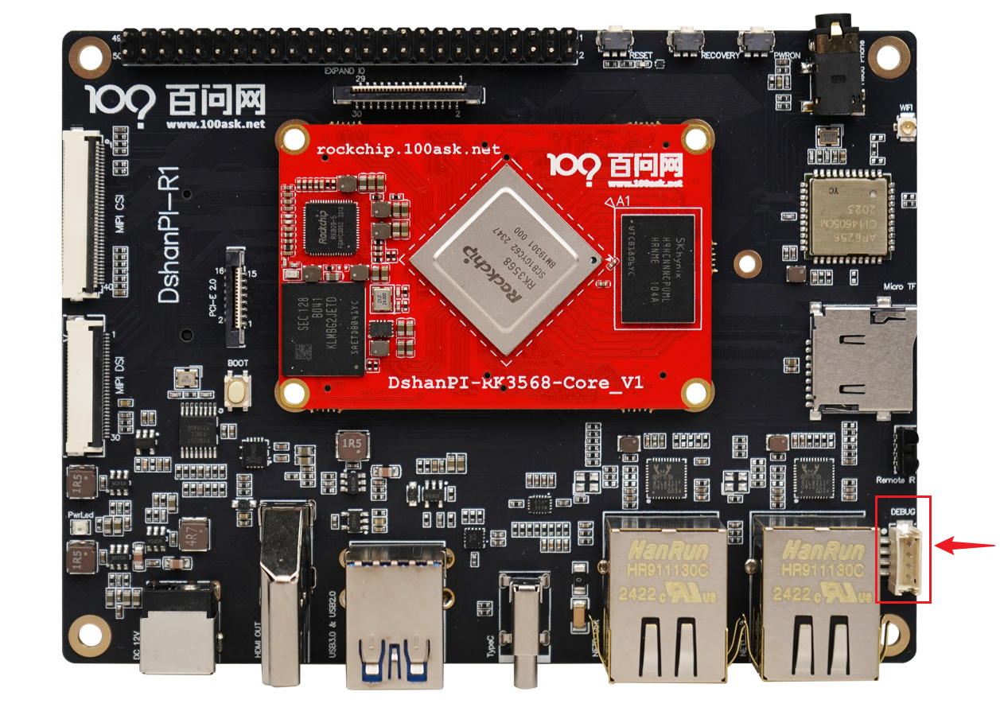

使用一根 typeC线 连接至 开发板otg接口，typeC线另一端 连接至 电脑usb接口，可以用来 **烧录系统** 和 **adb登录**(这个下面有讲到)。接着，使用杜邦线把TTL转串口模块 连接至 开发板DEBUG排线上，**TTL转串口模块的RX** 连接 **开发板DEBUG排线的T**，**TTL转串口模块的TX** 连接 **开发板DEBUG排线的R**，**TTL转串口模块的GND** 连接 **开发板DEBUG排线的G**，连接完成后，可以在设备管理器上看到TTL转串口模块的型号端口。比如这里使用的是CH340模块：

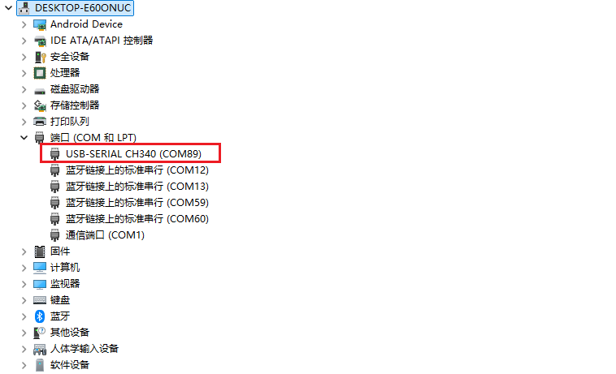

### 打开串口终端工具

出现上面的端口之后（不一定一样），双击打开已经安装好的MobaXterm终端工具，点击左上角的 **Session** 。

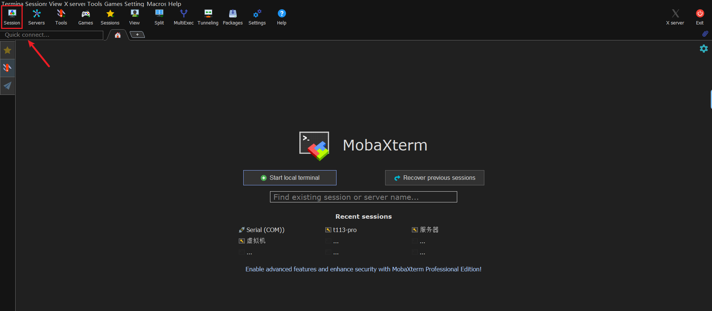

选择串口 **Serial** 。

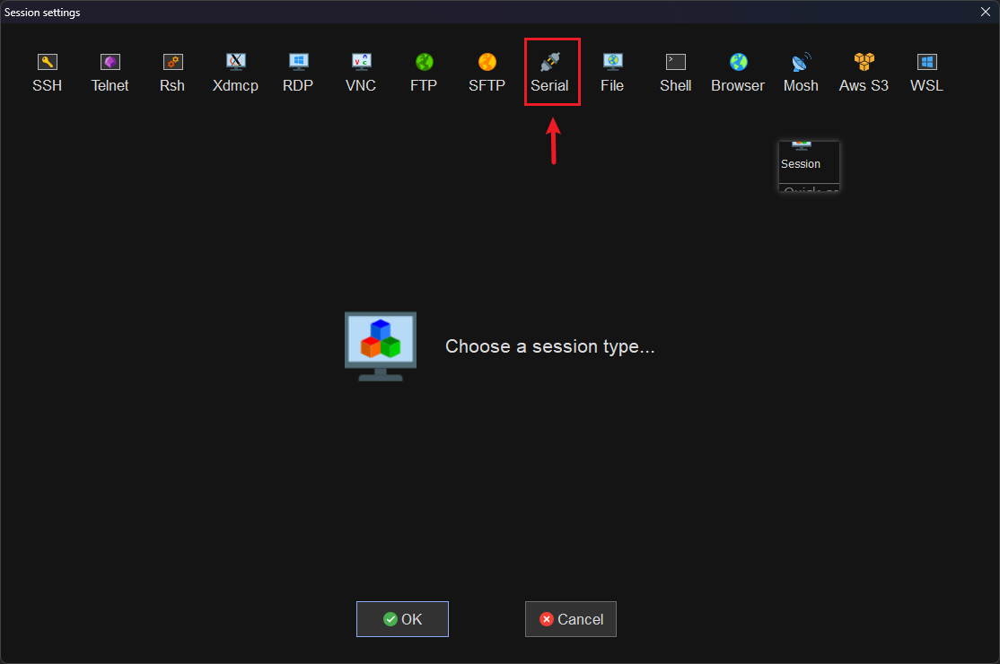

找到刚刚连接串口后，在设备管理器上显示端口号。

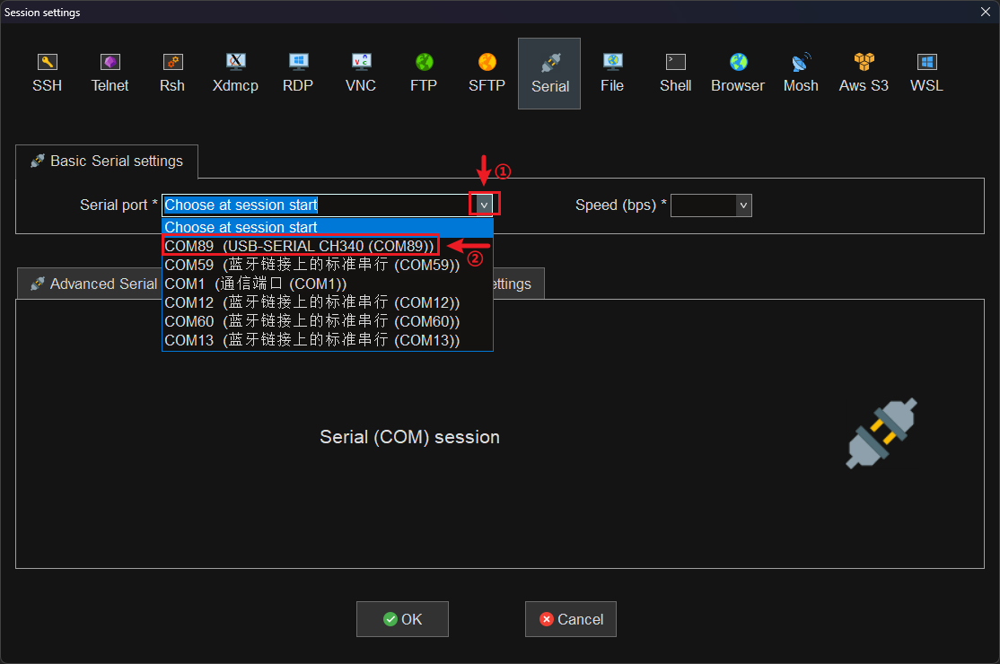

选择波特率 **115200** 。

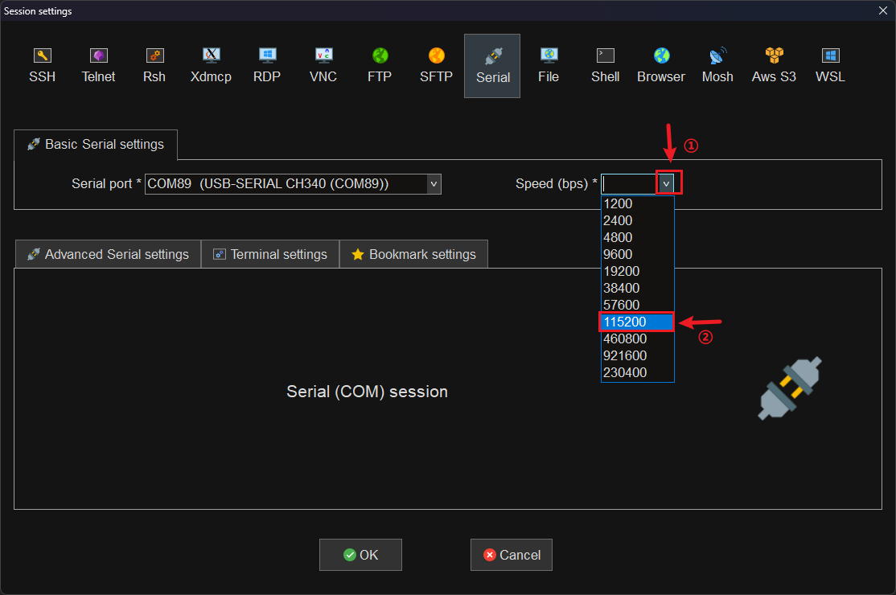

然后关闭流控，

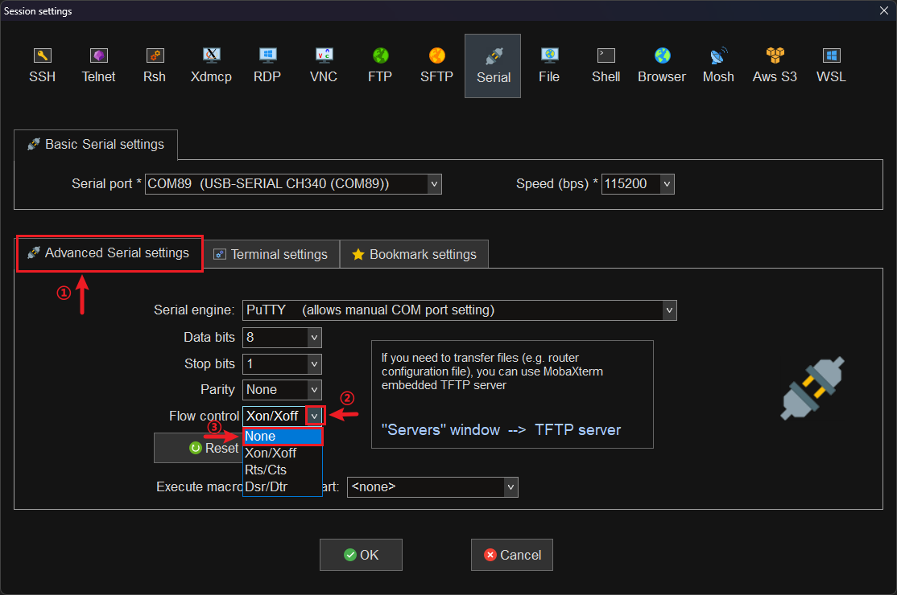

点击 **OK**，即可进入开发板的终端界面。

这个时候什么都没有显示，因为还没有上电。接入12V 电源，就可以看到开发板开机的整个流程。

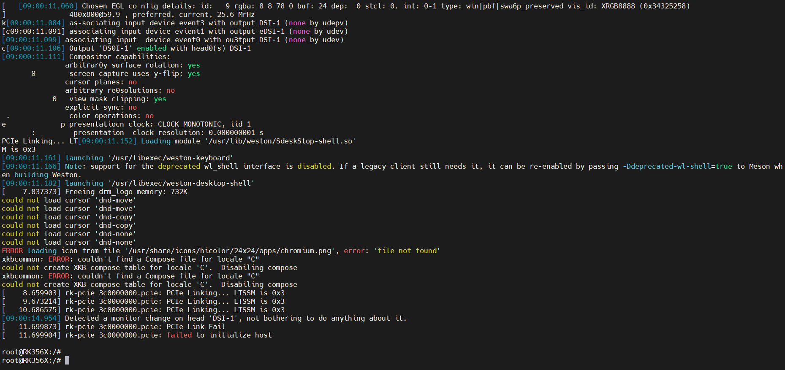

## ADB登录系统

ADB，全称为 **Android Debug Bridge**，是一个用于与安卓设备进行通信和调试的命令行工具，但现在不仅仅是 安卓设备，在嵌入式开发中，很多 Linux 设备也同样支持 adb 调试，例如 Rockchip 平台。可以使用这个工具在Ubuntu上登录终端，也可以在Windows上登录终端。下面将分别讲解。

### Ubuntu下使用ADB

#### 连接adb设备

打开VMware，进入ubuntu系统，点击虚拟机。

找到开发板的ADB端口，断开与主机(windows)的连接连接至ubuntu。

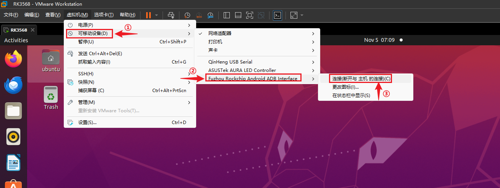

#### 下载adb工具

在ubuntu上，执行快捷键 `ctrl + alt + t` 打开终端。执行以下指令，下载adb工具。

~~~bash
sudo apt update
sudo apt install adb
~~~

下载完成后，执行以下指令，查看是否下载成功，

~~~bash
ubuntu@ubuntu2004:~$ adb version
Android Debug Bridge version 1.0.39
Version 1:8.1.0+r23-5ubuntu2
Installed as /usr/lib/android-sdk/platform-tools/adb
ubuntu@ubuntu2004:~$ 
~~~

使用adb登录之前，执行以下指令，查看是否能列出开发板设备并且是否可用。

~~~bash
ubuntu@ubuntu2004:~$ adb devices
List of devices attached
cca7b8659f061daf	device

ubuntu@ubuntu2004:~$
~~~

#### 登录系统

看到有设备列出，并且显示`device`，表示设备连接正常。确认无误之后，执行以下指令，使用adb登录系统。

~~~
adb shell
~~~

### Windows下使用ADB

#### 连接adb设备

开发板otg接口接上电脑之后，默认是连接至windows，如果之前选择了默认连接至ubuntu，需要断开ubuntu，连接至主机(windows)

断开之后，可以在设备管理器，看到有adb设备显示。

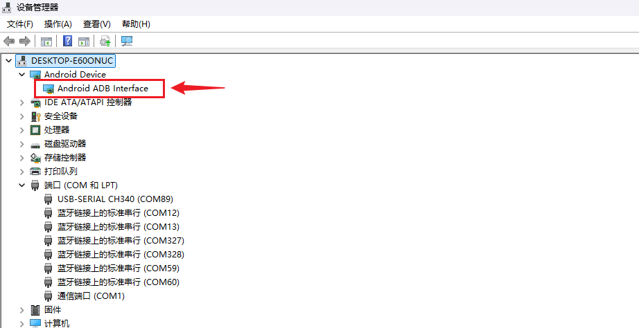

#### 下载adb工具

想要在windows上使用adb，与在ubuntu使用是类似，需要下载adb工具，进入官网 [adb下载](https://developer.android.google.cn/tools/releases/platform-tools?hl=zh-cn)，

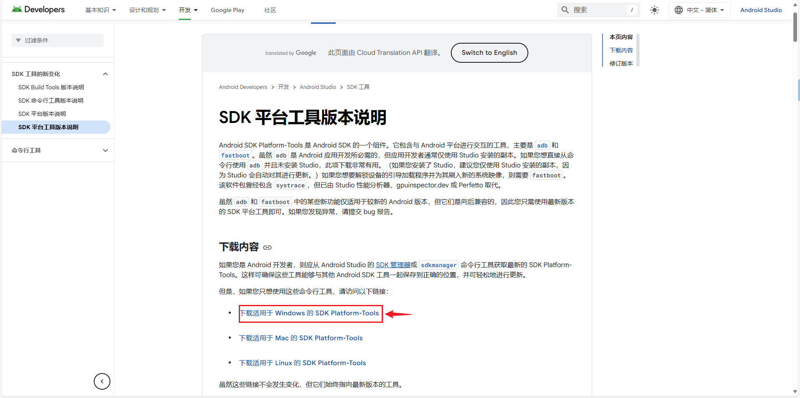

下载完成后，解压，得到一个 `platform-tools`文件，复制该文件夹路径，添加至环境变量。

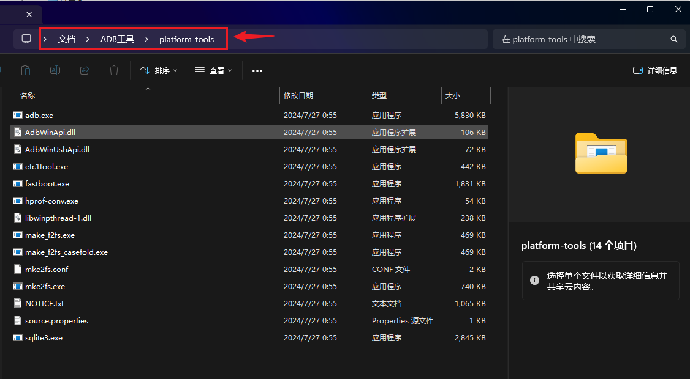

进入此电脑，鼠标右键选择属性

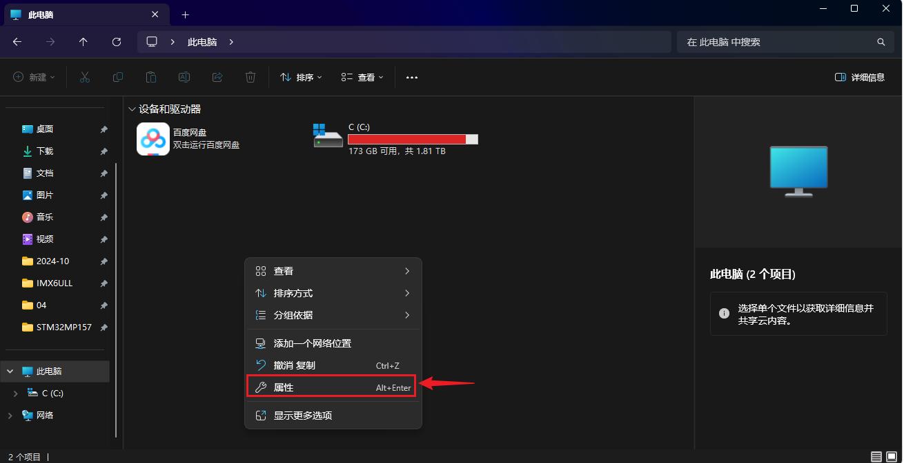

找到 `高级系统设置`，点击进入。

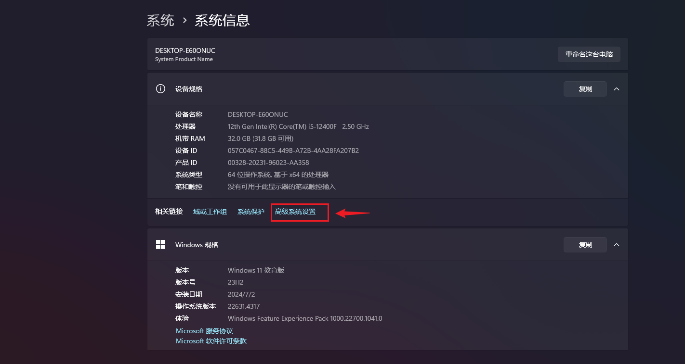

选择环境变量。

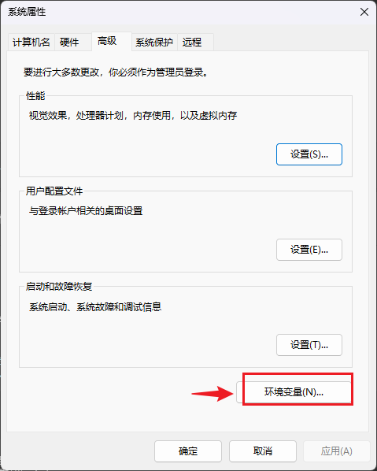

在系统变量里，找到 `Path`选项，点击编辑。

选择 `新建`，

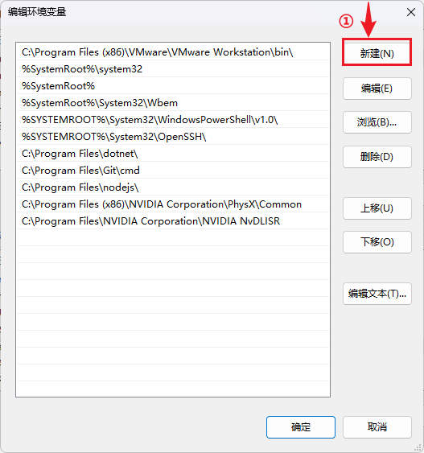

把之前复制的文件夹路径粘贴上去，最后点击确定。

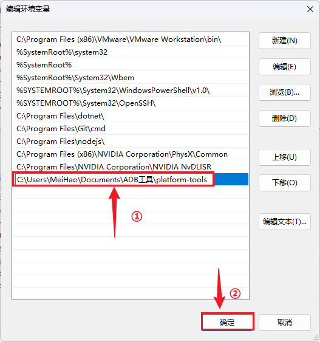

设置好环境变量之后，快捷键`win + r`，输入 `cmd` 运行对话框，执行 `adb devices`，

#### 登录系统

看到有设备列出，并且显示`device`，表示设备连接正常。确认无误之后，执行以下指令，使用adb登录系统。

~~~bash
adb shell
~~~

